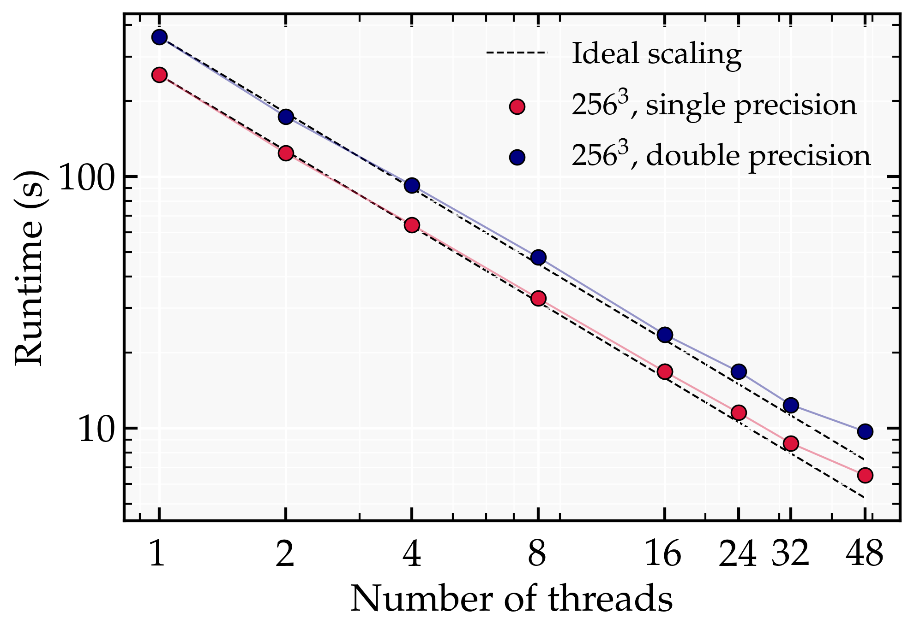

# Benchmarks

Performance benchmarks for parallel scaling on [**Gadi** — NCI's supercomputer](https://nci.org.au/our-systems/hpc-systems).

---

## System

| Property | Value |
|---|---|
| **System** | Gadi (NCI) |
| **CPU** |  Intel Xeon Platinum 8274 (Cascade Lake) 3.2 GHz  |
| **Cores per node** | 48 (2 × 24-core sockets) |
| **Compiler** | gcc 14.1.0 |


---

## Strong Scaling

A fixed problem size of $256^3$ is distributed across an increasing number of threads.
Runtime is wall-clock time in seconds.

### Results

| Threads | Runtime (s) | Speedup | Efficiency (%) |
|:---:|:---:|:---:|:---:|
| 1 | 253.6 | 1.00 | 100 |
| 2 | 123.9 | 2.00 | 100 |
| 4 | 64.3 | 3.94 | 98.6 |
| 8 | 32.8 | 7.73 | 96.7 |
| 16 | 16.8 | 15.11 | 94.4 |
| 32 | 8.7 | 29.12 | 91.1 |
| 48 | 6.5 | 38.99 | 81.2 |

> **Speedup** = T₁ / Tₙ &nbsp;·&nbsp; **Efficiency** = Speedup / N × 100



The dashed line shows ideal linear speedup. Deviation from ideal is expected due to
communication overhead and non-parallelisable portions of the code (Amdahl's Law).

---

## CPU vs GPU Runtime

The following benchmark measures the wall-clock runtime of a fixed test run
across three platforms:

- **Grid size:** $256^3$
- **Steps:** 1000

All runs use the same initial conditions, output settings, and build flags,
differing only in the platform and parallelisation backend.

### Results

| Platform | Compiler / Runtime | Threads | Runtime (s) |
|----------|--------------------|---------|-------------|
| Apple M4 (2024)| clang 17 | 10 | 1050 |
| Intel Xeon 8268 (2019)| gcc 14 | 12 | 1183 |
| Nvidia V100-SXM2 (2018)| CUDA 12.9 | — | 27.3 |


### GPU Speedup

The V100 GPU completes the same run in about 27 s, compared to more than 1000 s on
the Apple M4 and on the Xeon 8268. This corresponds to a speedup of
roughly **39×** over the M4 and **43×** over the Xeon.

The speedup is driven primarily by the GPU-accelerated FFT (cuFFT), which
dominates the cost of each time step at this grid size. The benefit is expected
to grow further at larger $N$, where the FFT cost scales as $N^3 \log N$ and
the GPU's parallelism is more fully utilised.

---
## Conclusions

- **Strong scaling** is efficient up to $\mathcal{O}(20)$ threads, beyond which communication overhead
  begins to dominate.
- ...


<!--- ## Reproducing These Results

```bash

for nthr in 1 2 4 8 16 32 48; do
    ...
done

# Collect results
bash collect_timings.sh
```

See [`collect_timings.sh`](collect_timings.sh) for the timing extraction script
and [`plot_speedup.py`](plot_speedup.py) for the plotting code.
--->
